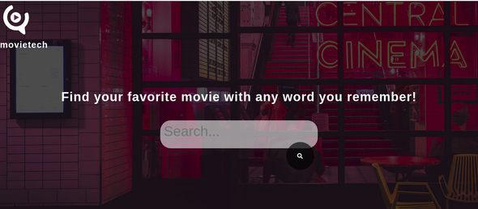
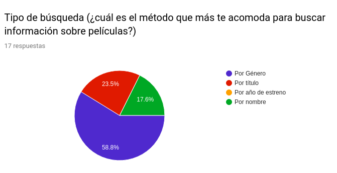
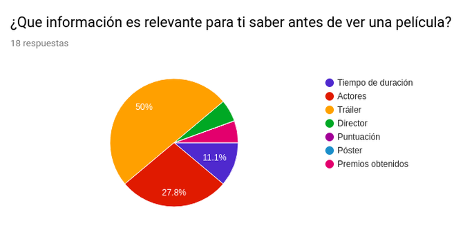
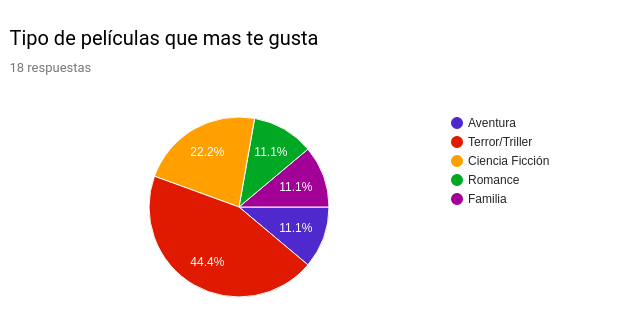
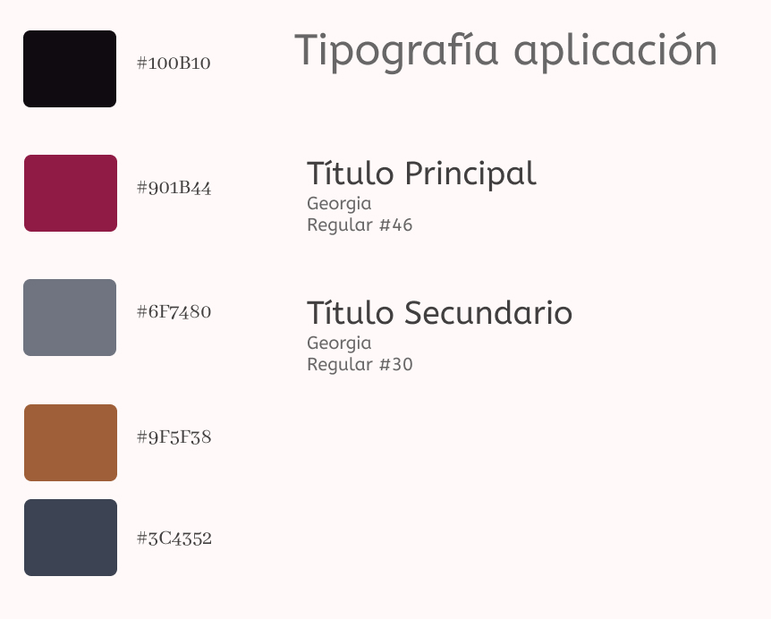
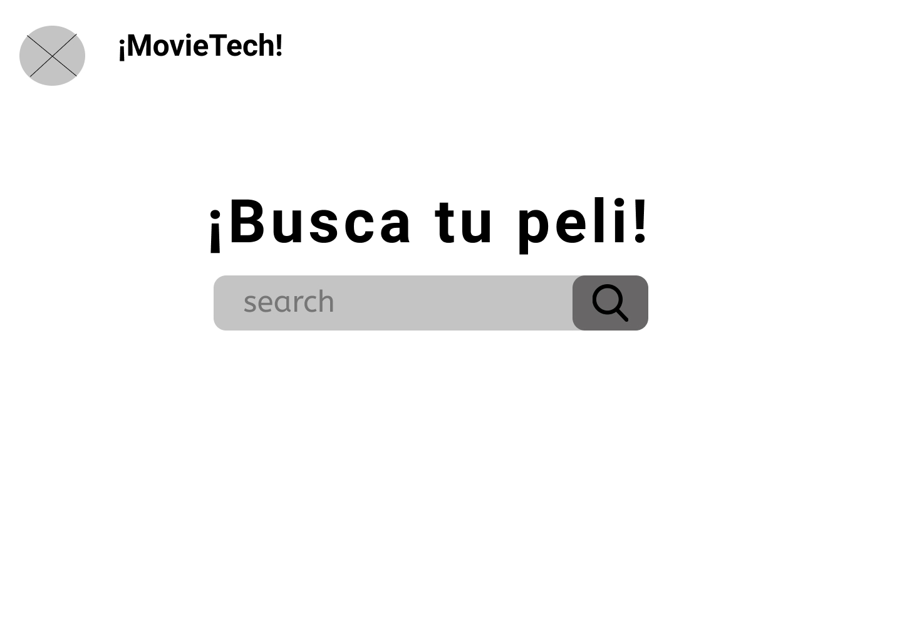
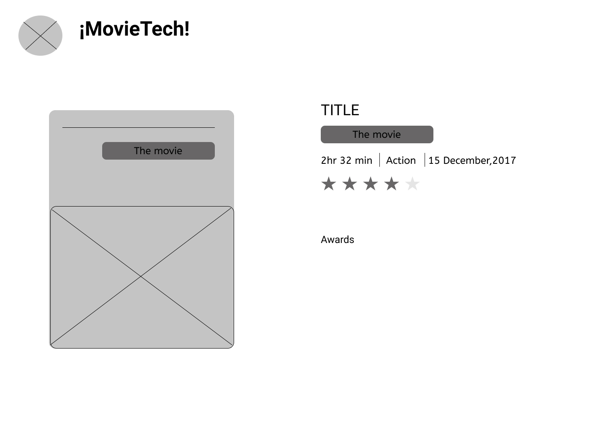
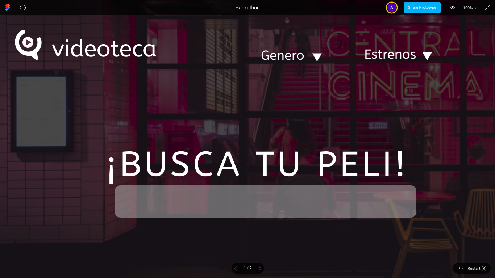
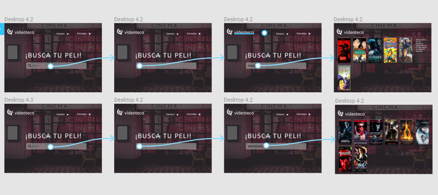

 ## [Movieteca](https://aleisabl.github.io/SCL008-hackathon-peliculas/) o [Movietech](https://aleisabl.github.io/SCL008-hackathon-peliculas/) 🎬

  

Movieteca o Movietech es una aplicación Web que nace con el objetivo de satisfacer a un público que posea un gusto especial por el cine pero que, a veces, olvida el nombre completo de la película. Está  dirigido a usuarios que gusten del análisis de los filmes antes de elegir qué película van a disfrutar. Este sitio web les permitirá buscar de manera ordenada la película deseada con su respectiva información como: ratings, runtime, genre, etc...

 ## Encuestas

El primer paso que realizamos en el proyecto fue un proceso investigación en donde en base a una encuesta realizada con un total de 18 respuestas, (la que solicitaba ser respondida solo si eran cinéfilos) obtivimos información y datos relevantes sobre lo que deberíamos dar a conocer en nuestro sitio.

RESULTADOS DE LA ENCUESTA: [Encuesta](https://docs.google.com/forms/d/1O9Dz2TDckx_AJ71ZEVi1gz1XbMrgenVntsPM_q2BcVk/edit)
1.- Tipo de búsqueda (¿cuál es el método que más te acomoda para buscar información sobre películas?):61.1% por Género, 22.2% por Título, 16.7% por Nombre.
2.- ¿Que información es relevante para ti saber antes de ver una película?: 50% Tráiler, 27.8% ACtores, 11.1% Duración.
3.- Tipo de películas que mas te gusta: 44.4% Terror/Triller, 22.2% Ciencia Ficción, 11.1% Aventura, 11.1% Familia, 11.1% Romance.

 ## Gráficos de los Resultados

 
 
 

## Proceso de diseño

Incialmente buscamos ideas y otras webs que nos sirvieran de inspiración para hallar nuestro enfoque, a partir de lo anterior creamos una paleta de colores y tipografías que estuvieran acorde a nuestra temática.

### Wireframe

 
Lamentablemente no se pudieron grabar los testeos realizados en esta etapa a diferentes personas, pero se recibió feedback importante como : 
 
 * Agregar algún tipo de logo que identifique a la app.

 * En vez de mostrar solo una película y toda la información de una vez, mostrar solo los poster con pequeña información y al hacer clic que se muestre más.

### Prototipo de alta fidelidad

*Trabajando en el prototipo de alta fidelidad a través de Figma*

Puedes testear nuestro figma aquí:
https://www.figma.com/file/VHgK3Nv2Q83BdqsZ2UjbjTqa/Hackathon?node-id=2%3A3

## Planificación y tareas

Nos dividimos las tareas según las habilidades de cada una, pero al mismo tiempo todas colaborando en conjunto y apoyando las ideas que teníamos.

* Alexandra: me encargué de hacer los archivos js, css y html. Investigué más sobre el fetch y gracias a la práctica del fetch en la iteración de Data Lovers logré hacerlo, luego procedí a leer la documentación de la omdbapi y cómo manipularla, con lo que llegué a utilizar el 's=' y agregarle una variable que es lo que ingresa el usuario, lo que da como resultado que la api va cambiando según lo que se ingresa.

Después me encargué de darle estilos con CSS y Bootstrap. Lo trabajé todo desde el principio con responsive, utilizando containers, rows, cards, modals y Media Query.

* Vanesa Morales realizó las encuestas, tambíen trabajó en el código y ayudó en la creación del read me.

* Carolina Méndez ayudó con las imágenes del proyecto, los elementos de figma y prototipado.

## Conclusión

Nuestro objetivo final es seguir mejorando nuestra aplicación web a travez de varias iteraciones que se irán realizando en el futuro. Algunas de ellas son:

* Agregar selectores por genero y estrenos.
* Añadir item "sobre nosotros".
* Ampliar búsqueda por fecha.
* Mostrar trailers en el resultado de búsqueda.
* Añadir botón estático para ir a la página de atrás.

