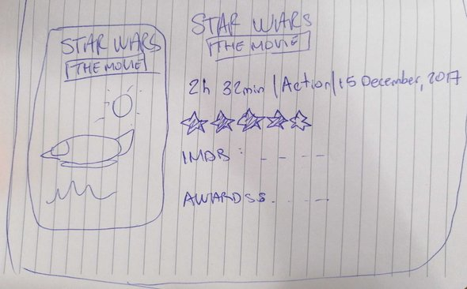

# "Hackathon" de final de _Common Core_, películas

 ## Movieteca

Movieteca es una aplicación Web que nace al querer satisfacer a un público que en éste caso tiene un gusto especial por el cine de terror, pero a veces olvida el nombre completo de la película. Va dirigido a usuarios que gusta del análisis de los filmes antes de elegir de qué película disfrutar. Este sitio web les permitirá buscar de manera ordenada las películas con sus respectiva información, como: ratings, runtime, genre, etc...

  

 ## Encuestas

El primer día del proyecto se realizó una pequeña investigación en base a una encuesta que respondieron 18 personas (la que solicitaba ser respondida solo si eran cinéfilos) con el fin de obtener información y datos relevantes sobre lo que deberíamos dar a conocer en nuestro sitio.

RESULTADOS DE LA ENCUESTA: [Encuesta](https://docs.google.com/forms/d/1O9Dz2TDckx_AJ71ZEVi1gz1XbMrgenVntsPM_q2BcVk/edit)
1.- Tipo de búsqueda (¿cuál es el método que más te acomoda para buscar información sobre películas?):61.1% por Género, 22.2% por Título, 16.7% por Nombre.
2.- ¿Que información es relevante para ti saber antes de ver una película?: 50% Tráiler, 27.8% ACtores, 11.1% Duración.
3.- Tipo de películas que mas te gusta: 44.4% Terror/Triller, 22.2% Ciencia Ficción, 11.1% Aventura, 11.1% Familia, 11.1% Romance.

 ## Gráficos de los Resultados

 
 
 

## Sketches

### Testeos de usabilidad

 
Lamentablemente no se pudieron grabar los testeos realizados en esta etapa a diferentes personas, pero se recibió feedback importante como : 
 
 * Agregar algún tipo de logo que identifique a la app.

 * En vez de mostrar solo una película y toda la información de una vez, mostrar solo los poster con pequeña información y al hacer clic que se muestre más.

#### Prototipo de alta fidelidad

*Trabajando en el prototipo de alta fidelidad a través de Figma*

## Planificación y tareas

Nos dividimos las tareas según las habilidades de cada una, pero al mismo tiempo todas colaborando en conjunto y apoyando las ideas que teníamos.

* 
*
*

